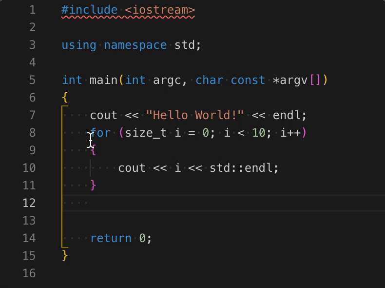

# scopeindentselection README

This extension will encapsulate selected code in curly brackets, and indent the selection inside.

## Known Issues

Not yet.

## Release Notes

This is a first try.

### 0.0.2

Adding GIF.

### 0.0.1

Initial release of scopeIndentSelection.
